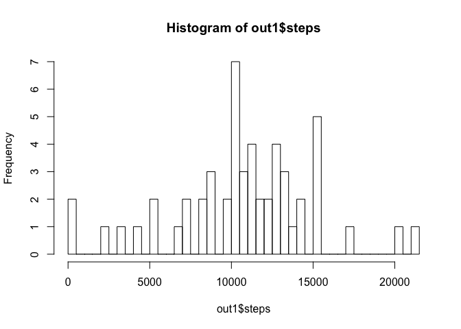
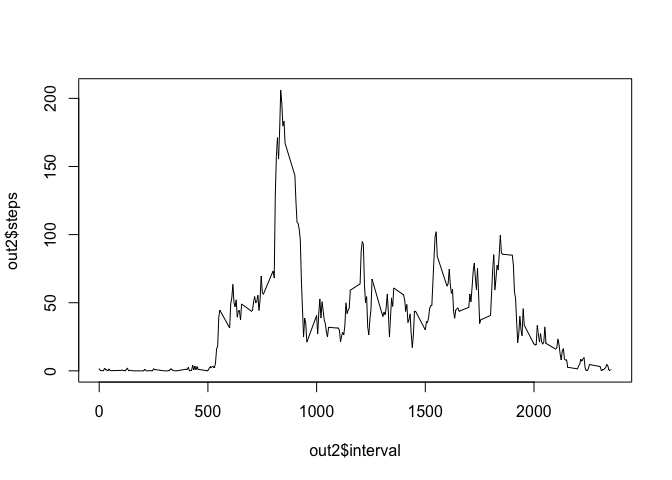
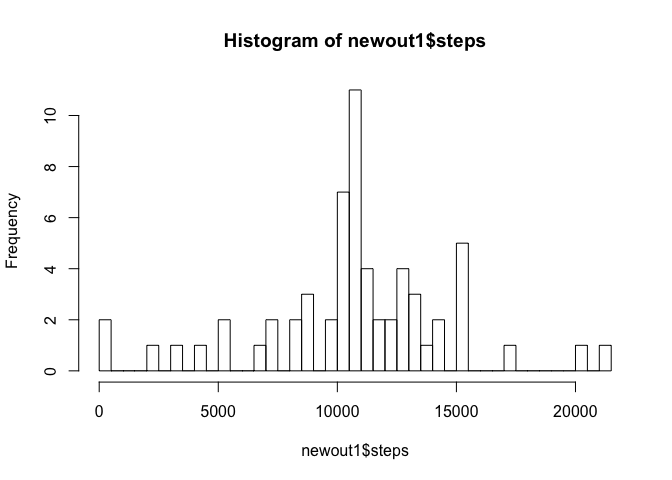
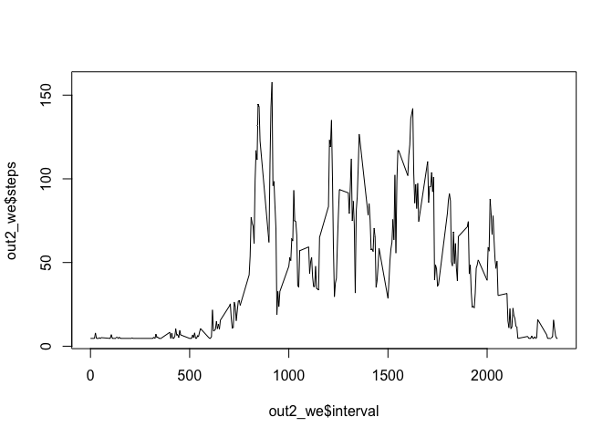
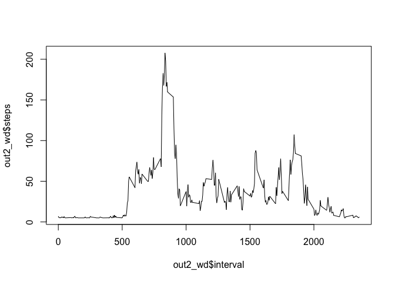

# Reproducible Research Week 2 Project
KH  
8/6/2017  

  
1) Loading and preprocessing the data


```r
setwd("~/Desktop/coursera/reproducible research/week 2 project")
activitydata <- read.csv("activity.csv", header = TRUE, sep = ",")
head(activitydata)
```

```
##   steps       date interval
## 1    NA 2012-10-01        0
## 2    NA 2012-10-01        5
## 3    NA 2012-10-01       10
## 4    NA 2012-10-01       15
## 5    NA 2012-10-01       20
## 6    NA 2012-10-01       25
```

2) What is mean total number of steps taken per day?

```r
library(dplyr)
out1 = activitydata %>% group_by(date) %>% summarise_each(funs(sum),steps)
hist(out1$steps,breaks=50)
```

<!-- -->

```r
meansteps <- mean(out1$steps,na.rm = TRUE)
mediansteps <- median(out1$steps,na.rm = TRUE)
```

The mean total number of steps taken per day is: 10766

The median total number of steps taken per day is: 10765

3) What is the average daily activity pattern?

```r
out2 = activitydata %>% group_by(interval) %>% summarise_each(funs(mean(., na.rm = TRUE)),steps)
plot(out2$interval, out2$steps, type="l")
```

<!-- -->

The maximum numbers of average steps is 206.17 and it occurs at time interval 835.  

4) Imputing missing values

```r
nummissing <- length(which(is.na(activitydata$steps)))
```
The number of missing values is: 2304

Now fill in missing data, and plot histogram

```r
library(Hmisc)
imputedactivitydata <- activitydata
imputedactivitydata$steps <- impute(activitydata$steps, fun=mean)
newout1 = imputedactivitydata %>% group_by(date) %>% summarise_each(funs(sum),steps)
hist(newout1$steps,breaks=50)
```

<!-- -->

```r
newmeansteps <- mean(newout1$steps,na.rm = TRUE)
newmediansteps <- median(newout1$steps,na.rm = TRUE)
```
The mean total number of steps using imputed data  is: 10766.19

The median total number of steps using imputed data is: 10766.19

There is very little impact of imputing missing data on the estimates of the total daily number of steps.  

5) Are there differences in activity patterns between weekdays and weekends?

Plot the average number of steps taken, averaged across all weekday days or weekend days.   

```r
library(chron)
imputedactivitydata$weekend = chron::is.weekend(imputedactivitydata$date)
data_we <- subset(imputedactivitydata, weekend == TRUE)
data_wd <- subset(imputedactivitydata, weekend == FALSE)
out2_we = data_we %>% group_by(interval) %>% summarise_each(funs(mean(., na.rm = TRUE)),steps)
out2_wd = data_wd %>% group_by(interval) %>% summarise_each(funs(mean(., na.rm = TRUE)),steps)
plot(out2_we$interval, out2_we$steps, type="l")
```

<!-- -->

```r
plot(out2_wd$interval, out2_wd$steps, type="l")
```

<!-- -->

There is a difference in activity patterns between weekdays and weekends. Weekend activity is more consistently high across the whole day, while weekday activity spikes early in the day.  


